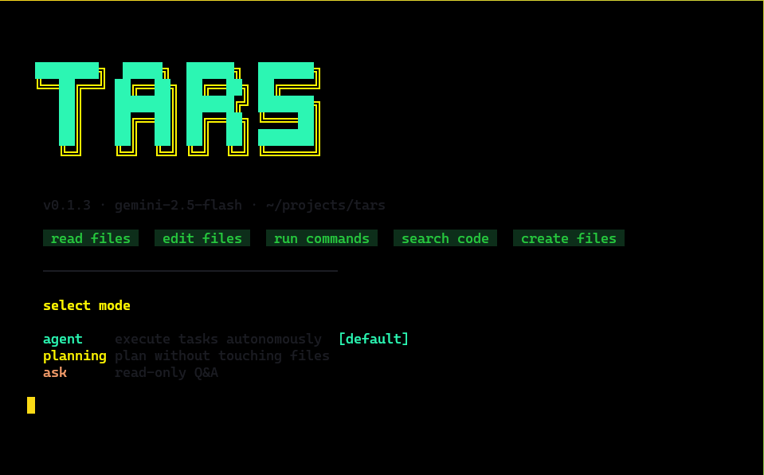

# TARS

> **Tactical Automated Response System** — An AI-powered CLI coding assistant that works with your codebase through natural language.

```bash
npm install -g tars-ai-cli
```

<p align="center">
  
</p>

---

## What is TARS?

TARS is a terminal-based AI assistant that understands your codebase and acts on it — reading files, writing code, running commands, and verifying results, all from a single prompt.

```
$ tars
What do you need? Add error handling to the readFile function
```

---

## Features

- **File Operations** — Read, edit, and create files with full context awareness
- **Code Search** — Find files and search content using glob patterns and regex
- **Shell Integration** — Execute commands directly through the assistant
- **Project Understanding** — Analyzes your codebase structure and patterns
- **Style Consistency** — Matches your existing code conventions automatically
- **Autonomous Loop** — Plans, executes, and verifies changes end-to-end

---

## Installation

```bash
npm install -g tars-ai-cli
```

> Requires Node.js v18 or higher.

---

## Setup

1. Get a free API key from [Google AI Studio](https://aistudio.google.com/app/apikey)

2. Create a `.env` file in your project root:

```bash
GOOGLE_GENERATIVE_AI_API_KEY=your_api_key_here
```

That's it.

---

## Usage

```bash
# Start TARS in any project directory
tars

# Check version
tars --version
```

### Example Prompts

```
What do you need? Add error handling to readFile function
What do you need? Find all TODO comments in the project
What do you need? Create a logger utility in src/utils
What do you need? Fix the TypeScript build errors
What do you need? Refactor the auth middleware to use async/await
```

---

## How It Works

TARS operates as an autonomous loop powered by Gemini 2.5 Flash:

1. **Understands** your request using natural language
2. **Analyzes** your codebase structure and patterns
3. **Plans** the necessary steps
4. **Executes** file operations and shell commands
5. **Verifies** the changes work correctly

### Available Tools

| Tool            | Description                                   |
| --------------- | --------------------------------------------- |
| `read_file`     | Read file contents with optional line ranges  |
| `edit_file`     | Modify files using exact string replacement   |
| `new_file`      | Create new files with proper formatting       |
| `grep`          | Search file contents using regex patterns     |
| `glob`          | Find files matching patterns (e.g. `**/*.ts`) |
| `shell_command` | Execute shell commands                        |

---

## Development

Clone and run locally:

```bash
git clone https://github.com/acegikmoo/tars
cd tars
bun install
```

Add your API key to `.env`, then:

```bash
bun run dev       # Run with auto-reload
bun run build     # Build for production
bun run lint      # Type checking
```

---

## Requirements

- Node.js v18+
- [Bun](https://bun.sh) v1.2.19+ _(for development only)_
- Google AI API key

---

## License

MIT — see [LICENSE](LICENSE) for details.
