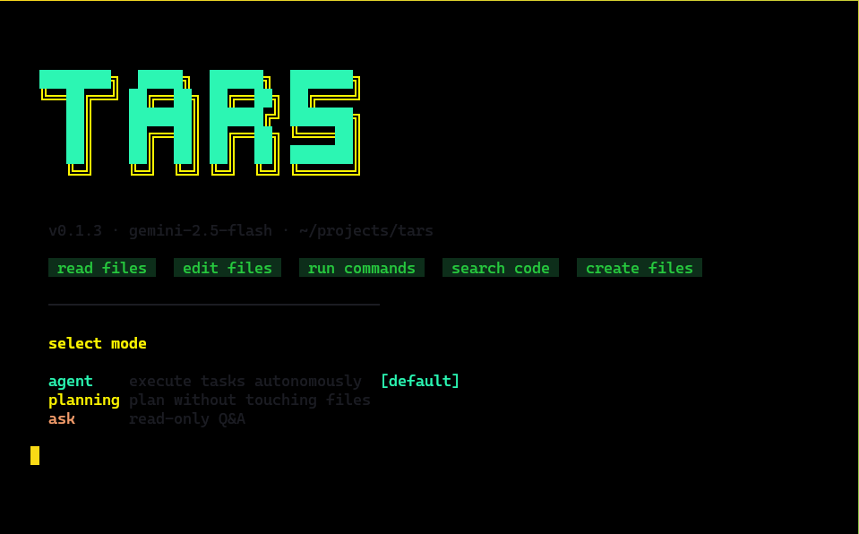

# TARS

> **Tactical Automated Response System** — AI-powered CLI agent that reads, edits, and executes across your codebase via natural language.

```bash
npm install -g tars-ai-cli
```

<p align="center">
  
</p>

---

## Overview

Point TARS at any project directory and it operates autonomously — analyzing structure, planning changes, executing them, and verifying results.

```
$ tars
✓ Started in AGENT mode

❯ Add error handling to the readFile function
```

---

## Features

- **Autonomous loop** — Plans, executes, and verifies changes end-to-end
- **Full file control** — Read, edit, and create files with codebase context
- **Code search** — Glob pattern and regex search across the project
- **Shell integration** — Run any command through the assistant
- **Three modes** — `agent` (execute), `ask` (read-only Q&A), `planning` (plan without changes)
- **File pinning** — Inject specific files into every prompt
- **Guardrails** — Blocks `.env`, private keys, and sensitive files by default
- **Token management** — Sliding context window across long sessions

---

## Tech Stack

| | |
|---|---|
| Language | TypeScript 5 |
| Runtime | Node.js v18+ / Bun (dev) |
| AI | Google Gemini 2.5 Flash via Vercel AI SDK |
| CLI | Commander.js, Chalk, cfonts |
| Validation | Zod v4 |
| Build | Bun → CJS |

---

## Setup

**Prerequisites:** Node.js v18+, [Google AI API key](https://aistudio.google.com/app/apikey)

```bash
npm install -g tars-ai-cli
```

Create a `.env` in your project root:

```env
GOOGLE_GENERATIVE_AI_API_KEY=your_api_key_here
```

Run in any project directory:

```bash
tars
```

---

## Modes & Commands

| Mode | Behavior |
|---|---|
| `agent` | Full execution — reads, edits, creates, runs commands |
| `ask` | Read-only — answers questions and explains code |
| `planning` | Analyzes and plans without modifying any files |

| Command | Description |
|---|---|
| `:mode [agent\|ask\|planning]` | Switch mode |
| `:pin <file>` | Pin file into every prompt |
| `:unpin <file>` | Unpin file |
| `:clear` | Clear the screen |
| `:help` | List all commands |
| `:exit` | Quit |

---

## Configuration

Optional `.tars.json` in your project root:

```json
{
  "llm": {
    "model": "gemini-2.5-flash",
    "temperature": 0.2
  },
  "features": {
    "maxContextTokens": 20000,
    "confirmEdits": false
  },
  "guardrails": {
    "blockReadPatterns": [".env", ".env.*", "*.pem", "*.key", ".npmrc"]
  }
}
```

---

## License

MIT — see [LICENSE](LICENSE).
